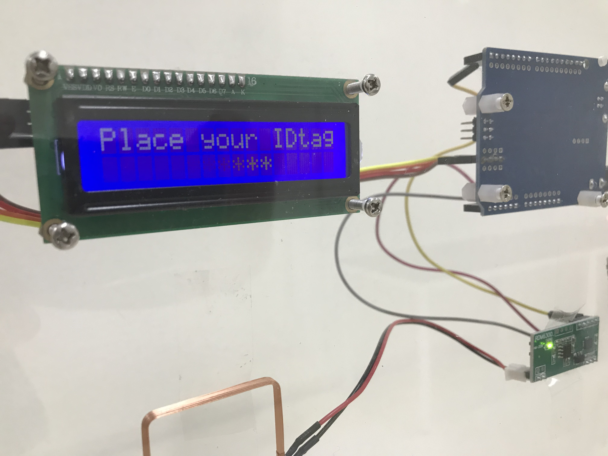
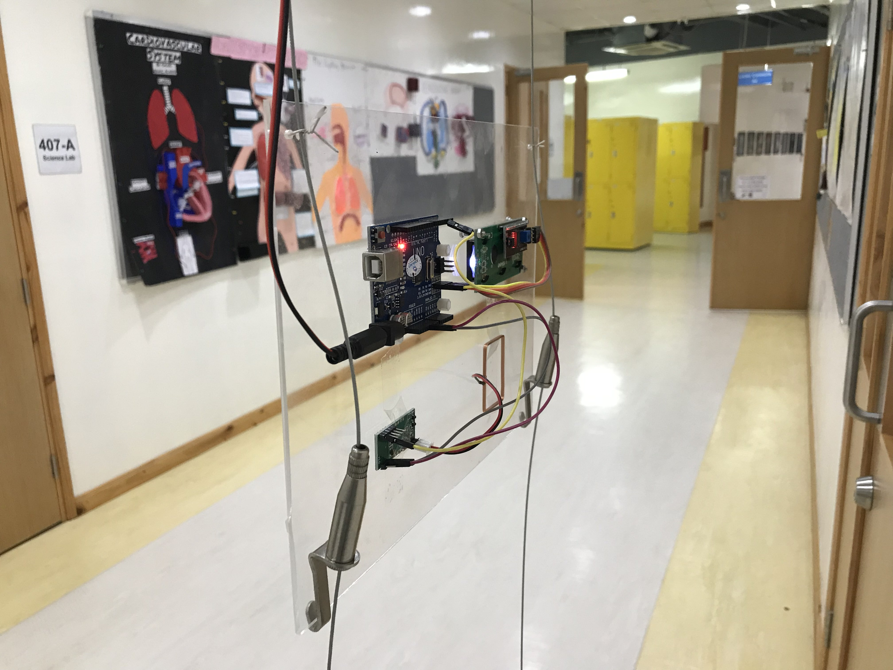
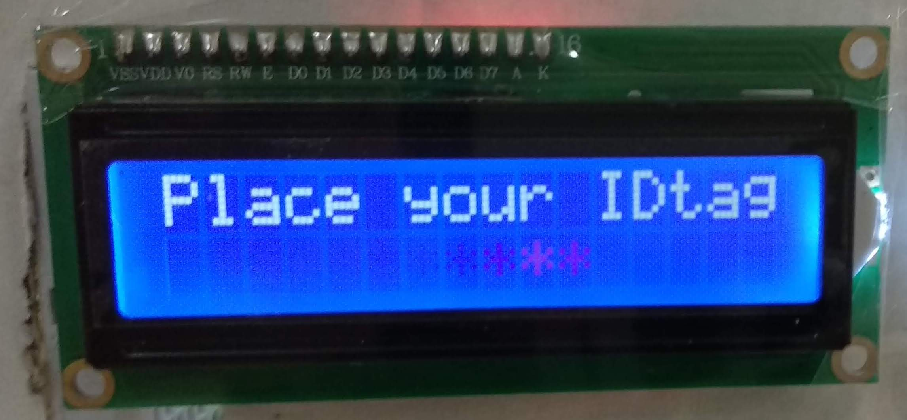
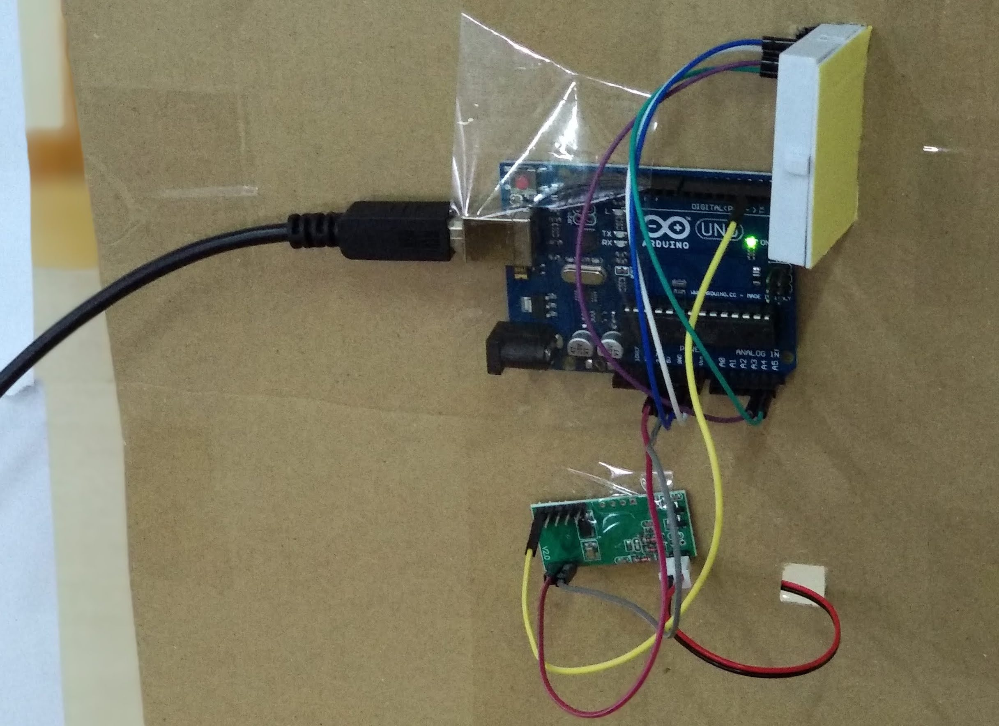
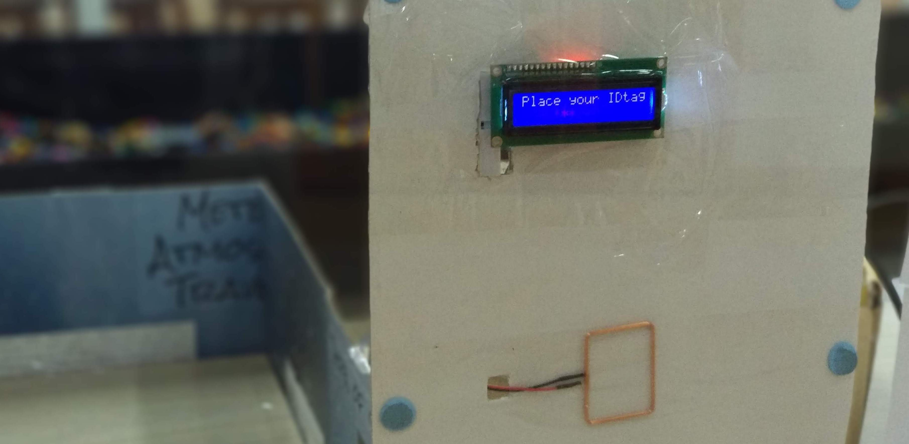

# RFID 125 kHz Reader with 1602 display

RFID reader for 125 kHz with 1602 display on Arduino. This is how our setup at the American International School Vietnam looks like:

 

### The display encourages you to ...

And that's all the Arduino behind it. Next time we use plexiglas to be more transparent :)

Find the code here:
(https://github.com/kreier/rfid/blob/main/arduino/rfid-125.ino)

## Materials

All materials were ordered at [CỬA HÀNG IC ĐÂY RỒI](https://icdayroi.com/). Total cost: 231.000₫ (10 US$). This is the list:

1. [Arduino UNO R3 DIP](https://icdayroi.com/arduino-uno-r3-dip) 110.000₫ Arduino Uno
2. [Module RFID RDM6300 125KHz giao tiếp UART](https://icdayroi.com/module-rfid-rdm6300-125khz-giao-tiep-uart) 59.000₫ RFID interface 125 kHz
3. [LCD1602 xanh lá 5V](https://icdayroi.com/lcd1602-xanh-la-5v) 30.000₫ LCD display, 16 symbols in 2 rows
4. [Module I2C giao tiếp LCD1602, LCD1604, LCD2004](https://icdayroi.com/mach-chuyen-giao-tiep-lcd1602-lcd1604-lcd2004-sang-i2c) 14.000₫ I2C adapter for display
5. [Bó dây jumper 100MM](https://icdayroi.com/bo-day-jumper-100mm) Some jumper wires 18.000₫

## Building steps

* Connect the RFID kit to the Arduino, as well as the 1602 with the I2C adapter and 4 wires
* Connections according to __link will follow__
* Upload the software found in the link above. Don't forget the library for the hd44780 controller and the hd44780_I2C expansion set. Files are located under library.

Got to [the wiki](https://github.com/matthiaskreier/rfid-125/wiki) for further details. We work on a new RTL-SDR to visualize the communication between the cards on the 125 kHz and 13.56 MHz frequency.

## Old pictures from 2018

The display encourages you to ...

And that's all the Arduino behind it. Next time we use plexiglas to be more transparent :)

